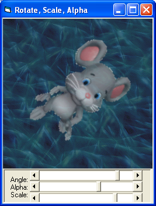



## Rotation \(Antialiased, Transpartent, Alpha, Quick\)

### Description

Rotates an image and paints it on the screen

RotBlt DestDC, Angle, x, y, Width, Height, Picture.Image.Handle, TransparentColor, Alpha, Scale

-Quick

-AntiAliased

-Transparency Color

-Alpha blended

-As easy as bitblt!

-Compatible on all windows versions!

 
### More Info
 

             |
---                |---
**Submitted On**   |2005-05-22 12:45:22
**By**             |[Lefteris Eleftheriades](https://github.com/Planet-Source-Code/PSCIndex/blob/master/ByAuthor/lefteris-eleftheriades.md)
**Level**          |Advanced
**User Rating**    |4.8 (53 globes from 11 users)
**Compatibility**  |VB 5\.0, VB 6\.0
**Category**       |[Graphics](https://github.com/Planet-Source-Code/PSCIndex/blob/master/ByCategory/graphics__1-46.md)
**World**          |[Visual Basic](https://github.com/Planet-Source-Code/PSCIndex/blob/master/ByWorld/visual-basic.md)
**Archive File**   |[Rotation\_\(190778712005\.zip](https://github.com/Planet-Source-Code/lefteris-eleftheriades-rotation-antialiased-transpartent-alpha-quick__1-61445/archive/master.zip)

